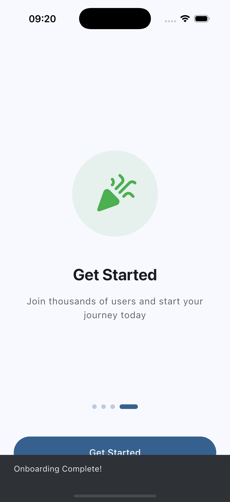

# Flutter Login UI – Material 3

A clean and modern **Flutter login UI template** built with **Material 3**.  
Designed for developers who want a solid starting point for authentication flows without wasting time on UI basics.

---

## ✨ Features

- Flutter UI built with Material 3
- Login screen (email + password)
- Clean, modern layout
- Mobile-first design
- Easy to integrate into existing projects

---

## 📸 Screenshots

Below are example screens included in the template:

---

## 🚀 Get the Full Template

This GitHub repository is for **showcase purposes**.

👉 **Download the full template (source code + files) on Gumroad:**  
**[https://griseo.gumroad.com](https://griseo.gumroad.com/l/dev-flutter-onboarding-template)**

---

## 🧠 Who is this for?

- Flutter developers
- Indie hackers
- App founders
- Anyone who wants a clean login UI fast

---

## 📄 License

UI previews and screenshots only.  
The full source code is available via Gumroad.
